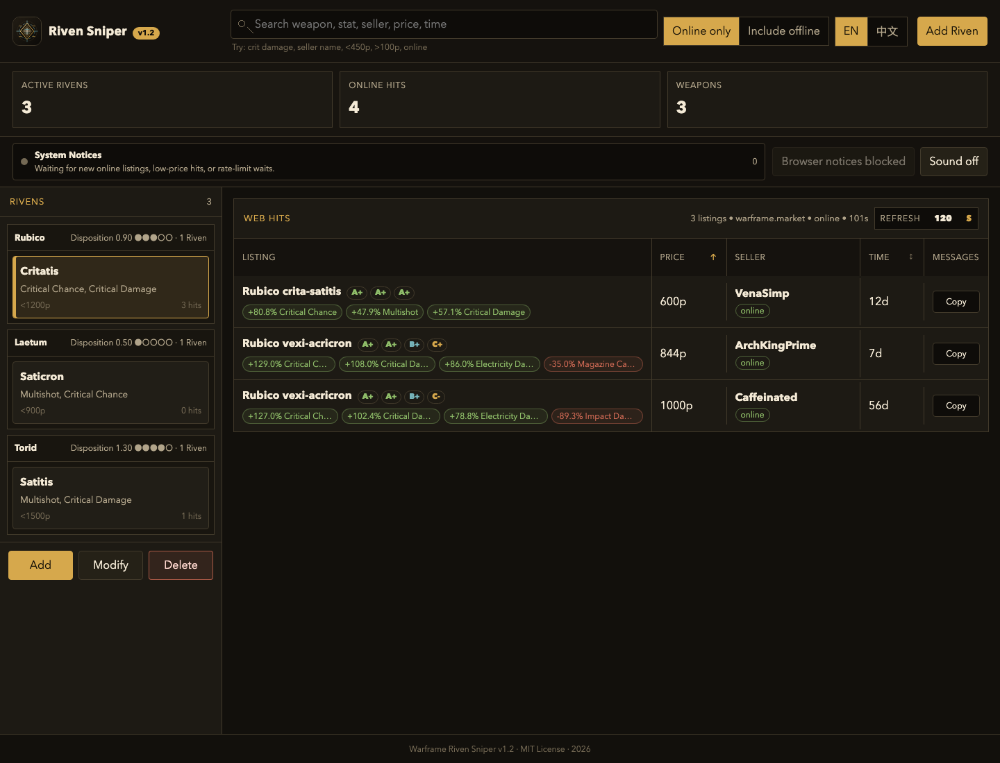

<p align="center">
  
</p>

<h1 align="center">Warframe Riven Sniper</h1>

<p align="center">
  A weapon-family Riven auction sniper with conservative dual-market refresh behavior.
</p>

<p align="center">
  
  
  
  
  
</p>

<p align="center">
  <a href="README.zh.md"></a>
  
</p>

<p align="center">
  
</p>

A small web app for tracking Warframe Riven auction listings by weapon family, selected positive stats, optional negative stat, seller status, price, and listing time.

The app keeps the workflow simple: create one or more Riven watches under a weapon, refresh Warframe.Market and Riven.market data conservatively, and surface matching reachable listings with a copy-ready in-game whisper.

### Features

- Tracks multiple Rivens per weapon family.
- Uses a generated catalog of Riven-capable weapon families.
- Supports English and Chinese weapon/stat display names.
- Filters market results by positive and negative Riven stats.
- Combines Warframe.Market and Riven.market Riven listings; rows show `WM` / `RM` source tags.
- Treats Warframe.Market `online` and `ingame` sellers as reachable, and normalizes Riven.market online / in-game states into online hits.
- Refreshes market data with per-weapon grouping, cache reuse, and rate-limit backoff.
- Shows system notices for new online listings, below-threshold prices, and rate-limit waiting states.
- Keeps local Riven watches in `data/rivens.json`, ignored by git.

### Quick Start

```bash
npm install
npm start
```

Open `http://localhost:4173`.

### Commands

| Command | Description |
| --- | --- |
| `npm start` | Start the local web server |
| `node scripts/build-riven-weapon-catalog.mjs` | Rebuild the generated Riven weapon catalog |

### Architecture

| Path | Purpose |
| --- | --- |
| `public/index.html` | Single-page UI |
| `server/app.js` | Static file serving and JSON API routes |
| `server/market.js` | Warframe.Market and Riven.market listing normalization, caching, grouping, and rate-limit behavior |
| `server/riven-weapons.generated.js` | Generated weapon catalog from Warframe Wiki disposition data plus localized Warframe Status item data |
| `server/store.js` | Local Riven watch persistence in `data/rivens.json` |

### Data Sources

- `warframe.market`: primary market source, using the public auction API to search Riven listings by weapon.
- `riven.market`: supplemental market source. The site does not expose a stable public JSON API, so the app queries the same HTML listing endpoint used by its list page and normalizes `.riven` data into the shared listing format.
- `Warframe Wiki`: source for Riven-capable weapon families and Riven disposition data.
- `warframestat.us`: source for localized weapon names.

Riven.market runs as a best-effort supplemental source. If it is slow, times out, or changes its page structure, the backend keeps Warframe.Market results and does not let the supplemental source block the main refresh.

### Refresh Behavior

The backend defaults to a 2-minute cache window. During refresh, it groups watches by weapon and searches each weapon once per market source, then filters the returned listings locally for every matching Riven watch.

Warframe.Market requests are sequential and spaced by 1 second. If Warframe.Market returns `429`, the backend retries the same weapon with progressive backoff: `10s`, `20s`, then `40s`. Large force-refreshes reuse valid per-weapon cache entries instead of refreshing every tracked weapon at once. Riven.market requests use a short timeout and independent cache; failures are recorded as source status and do not block primary market listings.

### System Notices

The web UI includes a notice center for three cases: new online listings, listings priced below the Riven watch's max-price threshold, and Warframe.Market rate-limit waiting. First load seeds existing listings silently so old orders do not flood the user.

Browser system notifications require the user to click "Enable browser notices" and grant permission. After permission is granted, the app immediately sends a test notification and records it in the in-page System Notices center. The "Sound" toggle can play a lightweight cue; the cue is synthesized with Web Audio in the browser, so no audio file is downloaded and no extra cache is created. The frontend only stores the latest 30 notices and the latest 500 seen listing keys. It does not store full listing caches, Discord webhooks, or QQ bot secrets.

Discord / QQ forwarding belongs on the backend server: configure webhook URLs or bot tokens through `.env`, then forward server-side notification events. Do not put those secrets in browser code or localStorage.

### Done

- System notices: new online listings, below-threshold prices, rate-limit waiting, browser test notices, and sound cues are implemented.

### TODO

0. Riven evaluation: score a Riven from weapon, positive/negative stats, price range, and current market listings.
1. Online demo: deploy a read-only demo so users can try the interface without running it locally.
2. External push: safely configure Discord / QQ forwarding on the backend without exposing webhook secrets to the web UI.
3. Faster Warframe.Market seller contact: generate quicker seller actions and in-game whisper messages from each listing.
4. Price history: keep comparable Riven price movement for better buy decisions.
5. Cloud sync: prepare accounts, database storage, and cross-device watch synchronization for the backend server.
6. Import/export: support backup, migration, and sharing of Riven watch configs.

### Notes

- This project is not affiliated with Digital Extremes, Warframe.Market, or Riven.market.
- Warframe and related names are trademarks of their respective owners.
- Stored Riven watches are local machine data in `data/rivens.json`, which is ignored by git.

### License

MIT. See `LICENSE`.
